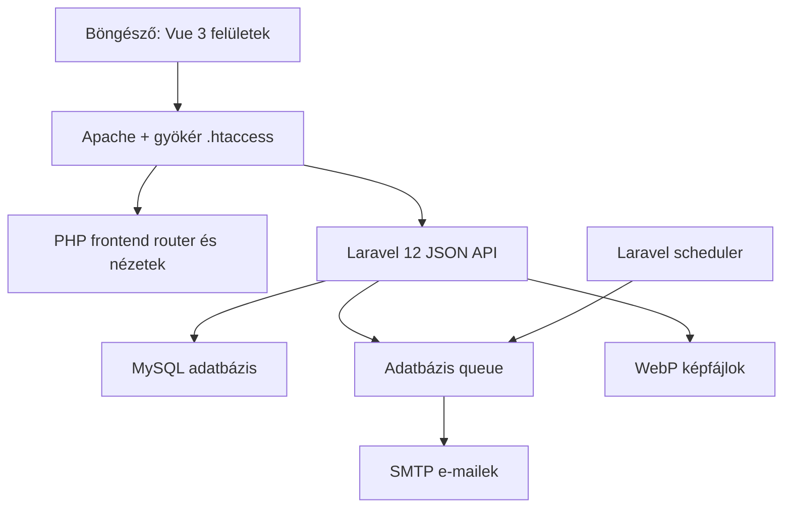

# Appointment Platform

**Magyar** | [English](README_EN.md)

Komplett, reszponzív online időpontfoglaló rendszer Laravel API-val és buildelés nélkül futó Vue 3 felülettel. A projekt egy szolgáltató vállalkozás teljes foglalási folyamatát kezeli a nyilvános időpontválasztástól az ügyfélfiókon és az automatikus e-maileken át az adminisztrációig, riportokig és adatmegőrzésig.

> **Projektállapot:** funkcionálisan érett bemutató/MVP, amely lokálisan teljes folyamatként használható. Éles használat előtt végezd el a production környezet beállítását és teljes körű tesztelését.

## Tartalomjegyzék

- [Mit old meg az alkalmazás?](#mit-old-meg-az-alkalmazás)
- [Fő funkciók](#fő-funkciók)
- [Felületek és útvonalak](#felületek-és-útvonalak)
- [Architektúra](#architektúra)
- [Technológiai stack](#technológiai-stack)
- [Fontos műszaki döntések](#fontos-műszaki-döntések)
- [Projektstruktúra](#projektstruktúra)
- [Rendszerkövetelmények](#rendszerkövetelmények)
- [Helyi telepítés XAMPP alatt](#helyi-telepítés-xampp-alatt)
- [Környezeti konfiguráció](#környezeti-konfiguráció)
- [Háttérfolyamatok](#háttérfolyamatok)
- [Owner- és adminfiókok](#owner--és-adminfiókok)
- [E-mail-rendszer](#e-mail-rendszer)
- [Tesztelés](#tesztelés)
- [Éles üzemeltetés](#éles-üzemeltetés)
- [Biztonság és adatvédelem](#biztonság-és-adatvédelem)
- [Mentés és visszaállítás](#mentés-és-visszaállítás)
- [Ismert korlátok és lehetséges továbbfejlesztések](#ismert-korlátok-és-lehetséges-továbbfejlesztések)
- [Bemutatás állásinterjún](#bemutatás-állásinterjún)
- [Licenc és tulajdonjog](#licenc-és-tulajdonjog)

## Mit old meg az alkalmazás?

Az Appointment Platform olyan szolgáltatóknak készült, akik online szeretnék kezelni az időpontjaikat, de nem akarnak külön weboldalt, foglalási rendszert, ügyfél-nyilvántartást és e-mailes értesítési megoldást fenntartani.

A rendszer egyetlen folyamatban biztosítja:

- a vállalkozás bemutatkozó és kapcsolati oldalát;
- a szolgáltatások, árak, időtartamok és pufferidők kezelését;
- a valós szabad időpontok kiszámítását;
- vendégként vagy opcionális ügyfélfiókkal történő foglalást;
- a foglalás biztonságos módosítását és lemondását;
- az adminisztrációt, ügyféltörténetet, e-mail-naplót és riportokat;
- a 24 és 2 órás emlékeztetőket;
- a kezelőlinkek, személyes adatok és naplók szabályozott lejáratát.

Az adatmodell és az API vállalkozásonként szeparált. A jelenlegi frontend egy konfigurált vállalkozást szolgál ki telepítésenként; ez többvállalkozásos alap, de még nem önkiszolgáló, közös SaaS-rendszer.

## Fő funkciók

### Nyilvános foglalási oldal

- Testreszabható vállalkozási oldal, szolgáltatásokkal, árakkal, képekkel és kapcsolati adatokkal.
- Havi és napi naptár valós, szerveroldalon számított szabad kapacitással.
- Munkaidő, blokkolások, szolgáltatási idő és pufferidő alapú foglalás.
- Vendégfoglalás jogi elfogadással, egyedi kezelőlinkkel és naptárintegrációval.
- Moderált csillagos értékelések, GYIK és reszponzív, akadálymentesített felület.

### Foglaláskezelő oldal

- Biztonságos, időkorlátos kezelőlink fiók nélküli önkiszolgáláshoz.
- Foglalás megtekintése, áthelyezése, lemondása és naptárba mentése.
- Konfigurálható módosítási és lemondási határidők.

### Opcionális ügyfélfiók

- E-mailes kóddal megerősített regisztráció és jelszavas belépés.
- Közelgő és korábbi foglalások, profil- és jelszókezelés.
- Aktív munkamenetek kezelése, teljes kijelentkeztetés és biztonságos fióktörlés.
- A vendégként rögzített korábbi foglalások kontrollált összekapcsolása.

### Admin- és ownerfelület

- Havi naptár, napi idővonal, manuális foglalás, blokkolások és státuszkezelés.
- Szolgáltatások, munkaidő, arculat, weboldaltartalom és jogi dokumentumok kezelése.
- Ügyféltörténet, belső jegyzetek, értékelésmoderáció és e-mail-napló.
- Automatikus emlékeztetők, havi statisztikák és XLSX-exportok.
- Foglalási szabályok, időzóna, ármegjelenítés és adatmegőrzés konfigurálása.

### Adminfiók és biztonsági funkciók

- Szerveroldali ownerlétrehozás, e-mailes aktiválás és elkülönített szerepkörök.
- Biztonságos profil-, e-mail-, jelszó- és munkamenetkezelés.
- Tokenlejárat, inaktivitási korlát, rate limit és vállalkozásszintű jogosultság-ellenőrzés.
- Régi adminfiók ellenőrzött eltávolítása igazolt owner megléte után.

## Felületek és útvonalak

| Felület | Útvonal | Cél |
|---|---|---|
| Nyilvános oldal | `/` | Bemutatkozás, szolgáltatások és foglalás |
| Ügyfélfiók | `/fiokom` | Belépés, regisztráció, foglalások és profil |
| Foglaláskezelés | `/manage?token=...` | Lemondás, áthelyezés és naptárba mentés |
| Admin | `/admin` | Teljes vállalkozás- és foglaláskezelés |
| Adatkezelés | `/adatkezeles` | Szerkeszthető adatkezelési tájékoztató |
| Feltételek | `/felhasznalasi-feltetelek` | Felhasználási és foglalási feltételek |
| Impresszum | `/impresszum` | Szolgáltatói adatok |
| Süti-tájékoztató | `/suti-tajekoztato` | Technikai tárolás ismertetése |
| API | `/api/v1/...` | Laravel JSON API |

## Architektúra



A frontend és az API ugyanazon projektcím alatt működik. A gyökér `.htaccess` az `/api` kéréseket a Laravel `backend/public/index.php` belépési pontjára, a többi útvonalat a `frontend/index.php` routerre irányítja.

Ez a felépítés lehetővé teszi, hogy az alkalmazás XAMPP alatt külön Node fejlesztői szerver és frontend build nélkül fusson.

## Technológiai stack

| Réteg | Technológia |
|---|---|
| Backend | PHP 8.2+, Laravel 12 |
| API-hitelesítés | Laravel Sanctum 4, Bearer tokenek |
| Frontend | Vue 3 global production build, natív JavaScript |
| Sablonok | PHP nézetek |
| Stílus | Saját reszponzív CSS |
| Adatbázis | MySQL/MariaDB; tesztekben SQLite memóriában |
| Háttérfeladatok | Laravel database queue |
| Ütemezés | Laravel Scheduler |
| E-mail | Laravel Mail, konfigurálható SMTP |
| Képfeldolgozás | PHP GD, WebP és bélyegkép-generálás |
| Export | Saját XLSX-generátor, PHP ZipArchive |
| Backendteszt | PHPUnit 11, Laravel Feature tesztek |
| Frontendteszt | Node.js alapú smoke-, RFC- és regressziós tesztek |
| Fejlesztői környezet | Windows, XAMPP, Apache, PowerShell |

Runtime közben nincs szükség `npm install`, `npm start`, Vite vagy külön Vue dev szerver használatára. Node.js csak a frontend tesztek futtatásához szükséges.

## Fontos műszaki döntések

### Többrétegű ütközésvédelem

A foglalási ütközéseket nem kizárólag a felület ellenőrzi. A szerver:

1. újraszámolja a foglalható idősávokat;
2. MySQL alatt vállalkozás + nap alapú named lockot kér;
3. adatbázis-tranzakcióban hajtja végre a módosítást;
4. aktív foglalásoknál egyedi `active_slot_key` adatbázis-korlátot is használ.

Ez védi a rendszert az egyszerre érkező publikus, admin- és áthelyezési kérések ellen.

### Időzóna-tudatos foglalás

Minden vállalkozás saját időzónát tárol. A foglalási ablak, lemondási és módosítási határidő, emlékeztetők, riportok és megjelenített időpontok ezt használják.

### Build nélküli Vue frontend

A build nélküli megoldás egyszerű XAMPP-os telepítést és gyors szerkeszthetőséget ad. Ennek ára, hogy a frontend jelenleg nem használ TypeScriptet, bundlert, komponenskönyvtárat vagy tree-shakinget. Egy nagyobb csapat vagy SaaS-termék esetén érdemes lenne Vite-alapú moduláris frontend felé továbblépni.

### Aszinkron e-mail és ütemezett emlékeztető

A webes kérés csak sorba állítja az e-mailes munkát. A queue worker végzi a tényleges küldést, a scheduler pedig percenként keresi az esedékes emlékeztetőket. A duplikációvédelmet a reminder napló és adatbázis-egyediségek biztosítják.

### Vendégfoglalás és opcionális fiók együtt

A foglaláshoz nem kötelező regisztrálni. A fiók kényelmi és önkiszolgáló funkciókat ad, miközben az egyedi kezelőlink továbbra is használható. Ez csökkenti a foglalási súrlódást, de lehetővé teszi a visszatérő ügyfelek jobb élményét.

## Projektstruktúra

```text
Appointment-platform/
├─ .htaccess                         # Apache útvonalkezelés és tiltások
├─ .gitignore
├─ .gitattributes
├─ README.md                         # Magyar dokumentáció
├─ README_EN.md                      # Angol dokumentáció
├─ backend/
│  ├─ app/
│  │  ├─ Console/Commands/          # Owner létrehozás, admin eltávolítás
│  │  ├─ Http/Controllers/Api/      # Publikus, ügyfél- és admin API
│  │  ├─ Http/Middleware/           # Jogosultság- és tokenellenőrzés
│  │  ├─ Jobs/                      # Sorba állított e-mail-küldés
│  │  ├─ Mail/                      # E-mail osztályok
│  │  ├─ Models/                    # Eloquent modellek
│  │  └─ Services/                  # Foglalás, slot, retention, riport stb.
│  ├─ config/
│  ├─ database/
│  │  ├─ migrations/
│  │  └─ seeders/
│  ├─ resources/views/emails/
│  ├─ routes/api.php
│  ├─ routes/console.php            # Ütemezett feladatok
│  ├─ scripts/                      # Windows workerindítók
│  ├─ storage/app/public/           # Feltöltött képek
│  └─ tests/Feature/
├─ docs/
│  ├─ setup/
│  │  ├─ SETUP_HU.md                # Magyar telepítési útmutató
│  │  └─ SETUP_EN.md                # English installation guide
│  ├─ deployment/                   # Üzemeltetési példák
│  ├─ legal/                        # Jogi mintadokumentumok
│  └─ qa/                           # Tesztelési segédanyagok
├─ scripts/                          # Repository-higiéniai ellenőrzések
└─ frontend/
   ├─ assets/                       # Közös JS, CSS és Vue runtime
   ├─ tests/                        # Node.js smoke és regressziós tesztek
   ├─ views/
   │  ├─ main/                      # Nyilvános foglalás
   │  ├─ manage/                    # Foglaláskezelés
   │  ├─ account/                   # Ügyfélfiók
   │  ├─ admin/                     # Adminfelület
   │  ├─ legal/                     # Jogi oldalak
   │  └─ not-found/                 # Egyedi 404
   └─ index.php                     # Frontend router
```

## Rendszerkövetelmények

- PHP `8.2` vagy újabb.
- Composer 2.
- Apache `mod_rewrite` és engedélyezett `.htaccess` (`AllowOverride All`).
- MySQL vagy kompatibilis MariaDB.
- PHP-bővítmények, legalább:
  - `pdo_mysql`;
  - `mbstring`;
  - `openssl`;
  - `fileinfo`;
  - `gd`, WebP támogatással;
  - `zip`, az Excel-exporthoz.
- Modern böngésző.
- Node.js 18+ kizárólag a frontend tesztekhez.
- Működő SMTP-fiók az éles e-mail-küldéshez.

## Helyi telepítés XAMPP alatt

A teljesen friss klóntól induló, részletes telepítési és adatbázis-visszaállítási leírás a [magyar telepítési útmutatóban](docs/setup/SETUP_HU.md) található. Az [angol változat](docs/setup/SETUP_EN.md) szintén elérhető.

### 1. Projekt elhelyezése

Példa XAMPP alatt:

```text
C:\xampp\htdocs\appointment-platform
```

### 2. Apache és MySQL

Indítsd el az Apache és MySQL szolgáltatást a XAMPP vezérlőpultján.

Hozd létre az adatbázist UTF-8 karakterkészlettel:

```sql
CREATE DATABASE appointment_platform
  CHARACTER SET utf8mb4
  COLLATE utf8mb4_unicode_ci;
```

### 3. Backend telepítése

```powershell
cd C:\xampp\htdocs\appointment-platform\backend
composer install
Copy-Item .env.example .env
php artisan key:generate
```

Állítsd be a `.env` adatbázis- és URL-értékeit, majd:

```powershell
php artisan migrate --seed
php artisan optimize:clear
```

> A `migrate:fresh --seed` minden meglévő táblát és adatot töröl. Csak eldobható fejlesztői adatbázison használd.

### 4. Megnyitás

Az alap telepítés példacímei:

```text
Foglalási oldal: http://localhost/appointment-platform/
Ügyfélfiók:      http://localhost/appointment-platform/fiokom
Admin:           http://localhost/appointment-platform/admin
```

### 5. Háttérfolyamatok

Fejlesztés közben indíthatók együtt:

```powershell
cd backend
.\scripts\start-workers.bat
```

Külön-külön:

```powershell
.\scripts\queue-worker.bat
.\scripts\scheduler-worker.bat
```

## Környezeti konfiguráció

A valódi `.env` soha ne kerüljön Gitbe, ZIP-es átadásba vagy nyilvános hibajegybe. Kiindulási alapként a `backend/.env.example` használható.

### Legfontosabb változók

| Változó | Szerep |
|---|---|
| `APP_ENV` | `local`, `testing` vagy `production` |
| `APP_DEBUG` | Élesben mindig `false` |
| `APP_URL` | Az alkalmazás alap URL-je |
| `FRONTEND_URL` | A frontend publikus címe |
| `PUBLIC_APP_URL` | E-mailes kezelőlinkek és naptárlinkek alapja |
| `APP_TIMEZONE` | Alapértelmezett alkalmazás-időzóna |
| `DB_*` | MySQL kapcsolat |
| `QUEUE_CONNECTION` | Éles/valós e-maileknél `database` |
| `MAIL_*` | SMTP-kapcsolat és feladó |
| `CORS_ALLOWED_ORIGINS` | Engedélyezett frontend eredetek |
| `BUSINESS_SEED_EMAIL` | Az első seedeléskor létrejövő vállalkozás kapcsolati és értesítési e-mail-címe |
| `ADMIN_IDLE_TIMEOUT_MINUTES` | Admin inaktivitási lejárat |
| `ADMIN_TOKEN_LIFETIME_MINUTES` | Admin token abszolút élettartama |
| `CUSTOMER_TOKEN_LIFETIME_MINUTES` | Ügyféltoken élettartama |
| `*_VERIFICATION_*` | Kódlejárat, próbálkozások és aktív kódok |
| `ADMIN_SEED_EMAIL` | Csak fejlesztői mintaadmin e-mail-címe |
| `ADMIN_SEED_PASSWORD` | Csak local/testing mintaadmin jelszava |

Ha az alkalmazás címe megváltozik, például ngrok vagy éles domain miatt:

```env
APP_URL=https://pelda.example
FRONTEND_URL=https://pelda.example
PUBLIC_APP_URL=https://pelda.example
```

Utána:

```powershell
php artisan optimize:clear
```

## Háttérfolyamatok

### Queue worker

Felelős a foglalási, módosítási, lemondási, emlékeztető- és biztonsági e-mailek feldolgozásáért.

```powershell
php artisan queue:work database --queue=emails,default --sleep=3 --tries=5 --backoff=60 --timeout=90
```

### Scheduler

Felelős többek között:

- a 24 és 2 órás emlékeztetők percenkénti kereséséért;
- az adatmegőrzési szabályok napi futtatásáért;
- az árva képek heti takarításáért;
- a lejárt ellenőrzőkódok óránkénti törléséért;
- a lejárt Sanctum-tokenek takarításáért.

Fejlesztésben:

```powershell
php artisan schedule:work
```

Éles Linux-környezetben jellemzően percenként futó cron hívja a `schedule:run` parancsot, a queue workert pedig Supervisor vagy systemd tartja életben.

## Owner- és adminfiókok

### Éles owner létrehozása

Nincs nyilvános adminregisztráció. A tulajdonosi fiókot szerveroldalon kell létrehozni:

```powershell
cd backend
php artisan app:create-owner --business=default --name="Vevő Teljes Neve" --email="vevo@example.com"
```

A parancs e-mailes aktiválókódot küld. Database queue esetén a queue workernek már futnia kell.

### Régi admin eltávolítása

Csak az új owner sikeres aktiválása és belépési próbája után:

```powershell
php artisan app:remove-admin --business=default --email="regi-admin@example.com"
```

Az owner ezzel a paranccsal nem törölhető. Az eltávolított admin összes tokenje megszűnik, és biztonsági értesítések készülnek.

### Fejlesztői seed

Local/testing környezetben a seeder létrehozhat mintaadmint. Az `ADMIN_SEED_PASSWORD` értékét mindig tudatosan add meg, és ezt a fiókot ne használd éles tulajdonosi hozzáférésként.

## E-mail-rendszer

Az alkalmazás a következő eseményekhez képes ügyfél- és/vagy adminlevelet készíteni:

- új foglalás;
- foglalás módosítása;
- foglalás lemondása;
- 24 órás emlékeztető;
- opcionális 2 órás emlékeztető;
- ügyfélregisztrációs és jelszó-visszaállító kód;
- owneraktiválás, admin e-mail-csere és biztonsági események;
- admin tesztlevél.

Az adminfelületen elérhető:

- feladónév és válaszcím;
- eseményenkénti tárgy és sablonszöveg;
- e-mail-előnézet;
- elküldési státusz és hibaüzenet;
- keresés, szűrés és részletes napló;
- újraküldés;
- kézbesítési teszt.

Éles domainnél az SMTP mellett SPF, DKIM és DMARC DNS-beállítás is szükséges a megbízható kézbesítéshez.

## Tesztelés

A projekt jelenlegi forrása 13 Laravel Feature tesztfájlt, 55 backend tesztesetet és 8 Node.js frontend/RFC ellenőrzést tartalmaz.

### Backend

```powershell
cd backend
php artisan test
```

Célzott példák:

```powershell
php artisan test --filter=BookingCoreTest
php artisan test --filter=AdminAccountSecurityTest
php artisan test --filter=CustomerAccountTest
php artisan test --filter=ReminderWorkflowTest
```

A backendtesztek fő területei:

- admin- és ownerfiók-életciklus;
- hibás belépés, rate limit és tokenlejárat;
- vállalkozásonkénti jogosultság;
- foglalási ütközés, átfedés és pufferidő;
- lemondás, áthelyezés és kezelőlink-biztonság;
- e-mail és emlékeztető folyamat;
- ügyfélfiók és ügyféltörténet;
- adatmegőrzés és anonimizálás;
- értékelésmoderáció;
- képfeldolgozás;
- statisztika és XLSX-export.

### Frontend

PowerShellből:

```powershell
Get-ChildItem .\frontend\tests\*.mjs | ForEach-Object {
    node $_.FullName
}
```

A frontendellenőrzések lefedik többek között:

- a 360 és 390 pixeles mobil breakpointokat;
- skip linkeket, ARIA live régiókat és modális fókuszcsapdát;
- `prefers-reduced-motion` és forced-colors szabályokat;
- a foglalásból fiókba, majd vissza vezető folyamatot;
- az adminprofil külön nézetét;
- a kezelőlink és jogi modal viselkedését;
- az iCalendar RFC escapinget, CRLF-sorvéget, 75 oktettes sortördelést, stabil UID-t és időzónát;
- a jelszómegjelenítő gombokat és naptárintegrációt.

Release előtt minden tesztnek zölden kell lefutnia a célkörnyezetben is. Az Excelteszthez a PHP `zip`, a képteszthez GD/WebP támogatás szükséges.

## Éles üzemeltetés

Minimális élesítési követelmények:

1. HTTPS domain és megfelelő Apache/Nginx virtual host.
2. A publikus document root ne tegye közvetlenül elérhetővé a teljes XAMPP-ot, phpMyAdmint vagy más projekteket.
3. `APP_ENV=production` és `APP_DEBUG=false`.
4. Egyedi `APP_KEY`, adatbázis-jelszó és SMTP-hitelesítő adatok.
5. A három URL-változó a végleges HTTPS-címre állítva.
6. Folyamatos queue worker és Laravel scheduler.
7. Írható Laravel `storage` és `bootstrap/cache` könyvtár.
8. Rendszeres adatbázis- és képfájlmentés.
9. Logrotáció és tárhelyfigyelés.
10. SMTP-domainhez SPF, DKIM és DMARC.
11. Visszaállítási próba, nem csak „elvileg van backup”.
12. Frissítések előtt karbantartási ablak és biztonsági mentés.

Telepítés után:

```powershell
cd backend
composer install --no-dev --optimize-autoloader
php artisan migrate --force
php artisan optimize
```

Reverse proxy vagy tunnel mögött szükség lehet a trusted proxy konfigurációra, hogy a generált linkek és a kliens IP-címe helyesen jelenjenek meg.

## Biztonság és adatvédelem

### Megvalósított védelmek

- Laravel Sanctum tokenes hitelesítés.
- Elkülönített admin- és ügyféltoken-képességek.
- `owner`, `admin` és `user` szerepkörök.
- Vállalkozás-tulajdon ellenőrzése minden védett üzleti erőforrásnál.
- Abszolút admin-tokenlejárat és inaktivitási lejárat.
- Kijelentkezéskor és biztonsági változtatásokkor token-visszavonás.
- Rate limit a belépési, kód- és értékelési végpontokon.
- Hash-elt jelszavak.
- Időkorlátos, próbálkozás-számlált ellenőrzőkódok.
- Általános válasz az elfelejtett jelszó kérésére, hogy ne legyen egyszerű fiókfelismerés.
- Véletlenszerű és lejáró foglaláskezelő tokenek.
- Kétszintű plusz adatbázis-szintű foglalási ütközésvédelem.
- Korlátozott fájltípus és fájlméret képfeltöltésnél.
- WebP-konverzió és külön bélyegkép.
- Jogi szövegek szerveroldali tisztítása.
- Kötelező jogi elfogadás rögzített hash-sel.
- Konfigurálható adatmegőrzés, anonimizálás és kezelőlink-lejárat.
- Adminműveletek egy részéről biztonsági e-mail.

### Fontos adatvédelmi megjegyzés

A beépített jogi dokumentummezők technikai keretet adnak, de nem helyettesítik az adott vállalkozásra szabott, szakember által ellenőrzött adatkezelési tájékoztatót, feltételeket, impresszumot vagy adatfeldolgozói megállapodást.

## Mentés és visszaállítás

Egy használható mentésnek együtt kell tartalmaznia:

- a MySQL adatbázist;
- a `backend/storage/app/public/businesses` logókat;
- a `backend/storage/app/public/services` szolgáltatásképeket;
- az aktuális, titkosan tárolt környezeti konfigurációt vagy annak biztonságos újraépítési leírását.

Az adatbázis és a képfájlok egy időponthoz tartozó mentése szükséges, különben az adatbázis nem létező fájlokra hivatkozhat.

Visszaállítási próba ajánlott menete:

1. külön tesztadatbázis létrehozása;
2. dump importálása;
3. képek visszamásolása;
4. teszt `.env` beállítása;
5. `php artisan optimize:clear`;
6. nyilvános oldal, admin, foglalás és e-mail queue ellenőrzése.

## Ismert korlátok és lehetséges továbbfejlesztések

- A frontend jelenleg egy vállalkozás slugját használja; nincs önkiszolgáló tenant-regisztráció és közös SaaS vezérlőpult.
- Az `owner` és `admin` szerepkör életciklusa különbözik, de a részletes, műveletenkénti RBAC még nem teljes; az adminfelületi hozzáférésük jelenleg nagyrészt azonos.
- Nincs teljes, minden adminmódosítást rögzítő auditnapló.
- Nincs online fizetés, számlázás vagy pénzügyi szolgáltatói integráció.
- Nincs több munkatársra, kezelőre, szobára vagy eszközre bontott erőforrásnaptár.
- Nincs kétfaktoros TOTP vagy passkey; az ellenőrzési folyamatok e-mail-kódot használnak.
- Az ügyfélfiók e-mail-címe jelenleg nem módosítható a profilból.
- Nincs natív mobilalkalmazás; a webfelület reszponzív.
- A háttérfolyamatok leállása nem akadályozza meg feltétlenül a foglalást, de az e-mailek és emlékeztetők késnek.
- A statisztikai bevétel becslés, nem könyvelési adat.
- A jelenlegi Apache/XAMPP útvonalkezelés Nginxhez külön konfigurációt igényel.
- A statikus/smoke frontendtesztek mellett később hasznos lenne Playwright vagy Cypress alapú teljes böngészős E2E teszt.
- Nagyobb csapatnál indokolt lehet Vite, moduláris komponensek, TypeScript és CI/CD bevezetése.


## Licenc és tulajdonjog

A projekt saját fejlesztésű, szerzői jogi védelem alatt álló szoftver. A repository nyilvános elérhetősége megtekintési és portfóliócélt szolgál; a projekt nem open-source.

Minden jog fenntartva. A forráskód egészének vagy részének felhasználása, másolása, módosítása, terjesztése, újraközlése, továbbértékesítése vagy kereskedelmi célú alkalmazása kizárólag a szerző előzetes írásos engedélyével lehetséges.

Kereskedelmi licencelés, egyedi bevezetés vagy a termékhez kapcsolódó jogok átruházása külön írásbeli megállapodás alapján történhet.

A projektben használt külső könyvtárak, keretrendszerek és egyéb függőségek a saját licenceik feltételei alá tartoznak.

---

**Appointment Platform** — egy projekt, amely végigviszi a foglalás teljes életciklusát a szabad kapacitás számításától a kommunikáción és önkiszolgáláson át az adminisztrációig és adatmegőrzésig.
