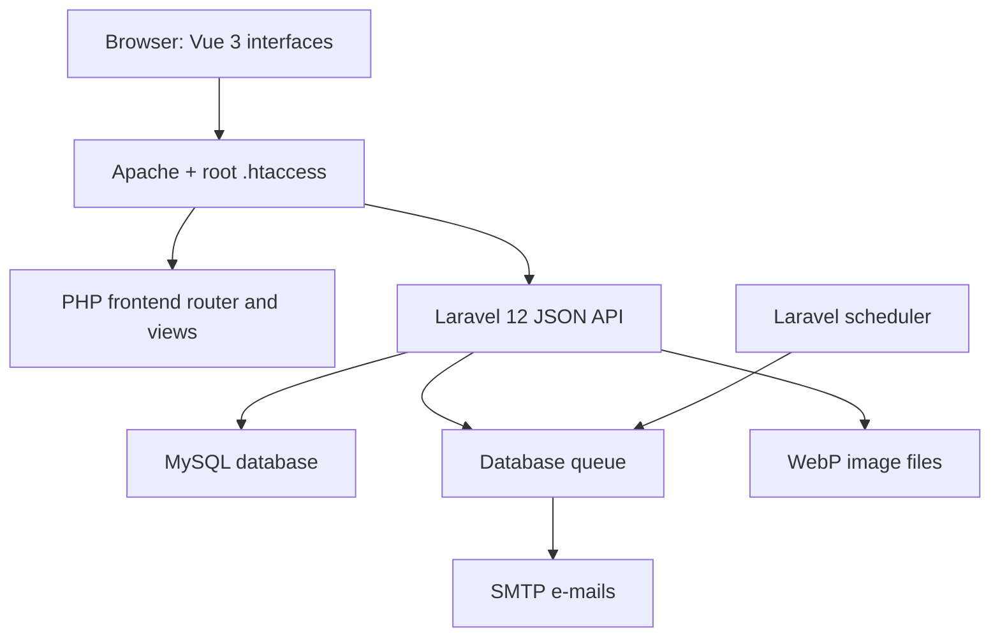

# Appointment Platform

[Magyar](README.md) | **English**

A complete, responsive online appointment booking system with a Laravel API and a Vue 3 frontend that runs without a build step. It covers the full booking lifecycle for a service business: public availability, customer accounts, automated e-mails, administration, reports, and data retention.

> **Project status:** a functionally mature demo/MVP that can be used as a complete local workflow. Before production use, configure the production environment and complete end-to-end testing.

## Table of contents

- [What problem does it solve?](#what-problem-does-it-solve)
- [Core features](#core-features)
- [Interfaces and routes](#interfaces-and-routes)
- [Architecture](#architecture)
- [Technology stack](#technology-stack)
- [Important technical decisions](#important-technical-decisions)
- [Project structure](#project-structure)
- [System requirements](#system-requirements)
- [Local installation with XAMPP](#local-installation-with-xampp)
- [Environment configuration](#environment-configuration)
- [Background processes](#background-processes)
- [Owner and administrator accounts](#owner-and-administrator-accounts)
- [E-mail system](#e-mail-system)
- [Testing](#testing)
- [Production operation](#production-operation)
- [Security and privacy](#security-and-privacy)
- [Backup and restore](#backup-and-restore)
- [Known limitations and possible improvements](#known-limitations-and-possible-improvements)
- [Presenting the project in an interview](#presenting-the-project-in-an-interview)
- [License and ownership](#license-and-ownership)

## What problem does it solve?

Appointment Platform is designed for service providers that need online scheduling without maintaining separate systems for a website, bookings, customer records, and e-mail notifications.

The application provides a single workflow for:

- business presentation and contact information;
- services, pricing, duration, and buffer times;
- real-time availability calculation;
- guest booking and optional customer accounts;
- secure rescheduling and cancellation;
- administration, customer history, e-mail logs, and reports;
- 24-hour and optional 2-hour reminders;
- controlled expiration of management links, personal data, and logs.

The data model and API isolate resources by business. The current frontend serves one configured business per installation. The backend is multi-business-ready, but the project is not yet a self-service shared SaaS platform.

## Core features

### Public booking page

- Customizable business page with services, prices, images, and contact details.
- Monthly and daily calendars based on server-calculated availability.
- Scheduling based on working hours, blocks, service duration, and buffer time.
- Guest booking with legal acceptance, a unique management link, and calendar integration.
- Moderated star ratings, FAQ, and a responsive, accessibility-aware interface.

### Booking management page

- Secure, time-limited management links for account-free self-service.
- View, reschedule, cancel, and add bookings to a calendar.
- Configurable cancellation and rescheduling deadlines.

### Optional customer account

- Password registration confirmed with an e-mail verification code.
- Upcoming and previous bookings, profile, and password management.
- Active session management, global logout, and protected account deletion.
- Controlled linking of earlier guest bookings made with the same e-mail address.

### Administration and owner interface

- Monthly calendar, daily timeline, manual booking, blocks, and status management.
- Services, working hours, branding, website content, and legal document management.
- Customer history, internal notes, review moderation, and e-mail logs.
- Automated reminders, monthly statistics, and XLSX exports.
- Configurable booking rules, timezone, price display, and data retention.

### Account and security features

- Server-side owner creation, e-mail activation, and separate roles.
- Secure profile, e-mail, password, and session management.
- Token expiration, idle timeout, rate limiting, and business-level authorization.
- Controlled removal of legacy administrator accounts after owner verification.

## Interfaces and routes

| Interface | Route | Purpose |
|---|---|---|
| Public page | `/` | Business presentation, services, and booking |
| Customer account | `/fiokom` | Login, registration, bookings, and profile |
| Booking management | `/manage?token=...` | Cancellation, rescheduling, and calendar export |
| Administration | `/admin` | Complete business and booking management |
| Privacy notice | `/adatkezeles` | Editable privacy information |
| Terms | `/felhasznalasi-feltetelek` | Usage and booking terms |
| Imprint | `/impresszum` | Service-provider information |
| Cookie notice | `/suti-tajekoztato` | Technical storage information |
| API | `/api/v1/...` | Laravel JSON API |

## Architecture



The frontend and API run under the same application URL. The root `.htaccess` sends `/api` requests to `backend/public/index.php` and routes the remaining application URLs through `frontend/index.php`.

This structure keeps local XAMPP installation simple: no Node development server or frontend build is required at runtime.

## Technology stack

| Layer | Technology |
|---|---|
| Backend | PHP 8.2+, Laravel 12 |
| API authentication | Laravel Sanctum 4, bearer tokens |
| Frontend | Vue 3 global production build, native JavaScript |
| Templates | PHP views |
| Styling | Custom responsive CSS |
| Database | MySQL/MariaDB; in-memory SQLite for tests |
| Background jobs | Laravel database queue |
| Scheduling | Laravel Scheduler |
| E-mail | Laravel Mail with configurable SMTP |
| Image processing | PHP GD, WebP conversion, thumbnails |
| Export | Custom XLSX generator, PHP ZipArchive |
| Backend tests | PHPUnit 11, Laravel feature tests |
| Frontend tests | Node.js smoke, RFC, and regression tests |
| Primary development environment | Windows, XAMPP, Apache, PowerShell |

The application does not require `npm install`, `npm start`, Vite, or a separate Vue server at runtime. Node.js is only needed to run the frontend test suite.

## Important technical decisions

### Layered booking conflict protection

Booking conflicts are not prevented only in the browser. The server:

1. recalculates valid time slots;
2. obtains a business-and-day MySQL named lock;
3. performs the operation inside a database transaction;
4. uses a unique `active_slot_key` constraint for active bookings.

This protects the system from simultaneous public, administrator, and rescheduling requests.

### Timezone-aware scheduling

Each business stores its own timezone. Booking windows, cancellation and rescheduling deadlines, reminders, reports, and displayed dates all use that setting.

### Build-free Vue frontend

The build-free frontend makes XAMPP installation and direct editing straightforward. The trade-off is that it currently does not use TypeScript, a bundler, a component library, or tree-shaking. A larger team or SaaS product would benefit from migration to Vite and modular components.

### Asynchronous e-mail and scheduled reminders

Web requests enqueue e-mail work instead of delivering messages synchronously. A queue worker handles delivery, while the scheduler searches for due reminders. Reminder logs and database constraints prevent duplicate messages.

### Guest booking and optional accounts

Registration is not required to book. Customer accounts add convenience and self-service features, while unique management links remain available to guests. This keeps the booking flow low-friction without sacrificing account functionality for returning customers.

## Project structure

```text
Appointment-platform/
├─ .htaccess                         # Apache routing and access restrictions
├─ .gitignore
├─ .gitattributes
├─ README.md                         # Hungarian project documentation
├─ README_EN.md                      # English project documentation
├─ backend/
│  ├─ app/
│  │  ├─ Console/Commands/          # Owner/admin and maintenance commands
│  │  ├─ Http/Controllers/Api/      # Public, customer, and admin API
│  │  ├─ Http/Middleware/           # Authorization and token checks
│  │  ├─ Jobs/                      # Queued e-mail delivery
│  │  ├─ Mail/                      # Mail classes
│  │  ├─ Models/                    # Eloquent models
│  │  └─ Services/                  # Booking, slots, reports, retention, etc.
│  ├─ config/
│  ├─ database/
│  │  ├─ migrations/
│  │  └─ seeders/
│  ├─ resources/views/emails/
│  ├─ routes/api.php
│  ├─ routes/console.php
│  ├─ scripts/                      # Windows worker launchers
│  ├─ storage/app/public/           # Runtime uploads, excluded from Git
│  └─ tests/Feature/
├─ docs/
│  ├─ setup/
│  │  ├─ SETUP_HU.md                # Hungarian installation guide
│  │  └─ SETUP_EN.md                # English installation guide
│  ├─ deployment/                   # Deployment examples
│  ├─ legal/                        # Legal document templates
│  └─ qa/                           # QA fixtures
├─ scripts/                          # Repository hygiene checks
└─ frontend/
   ├─ assets/                        # Shared JS, CSS, and Vue runtime
   ├─ tests/                         # Node.js smoke and regression tests
   ├─ views/
   │  ├─ main/
   │  ├─ manage/
   │  ├─ account/
   │  ├─ admin/
   │  ├─ legal/
   │  └─ not-found/
   └─ index.php                      # Frontend router
```

## System requirements

- PHP 8.2 or newer.
- Composer 2.
- Apache `mod_rewrite` with `.htaccess` enabled (`AllowOverride All`).
- MySQL or a compatible MariaDB version.
- PHP extensions including:
  - `pdo_mysql`;
  - `mbstring`;
  - `openssl`;
  - `fileinfo`;
  - `gd` with WebP support;
  - `zip` for Excel exports.
- A modern browser.
- Node.js 18+ only for frontend tests.
- A working SMTP account for production e-mail delivery.

## Local installation with XAMPP

### 1. Place or clone the project

Example:

```text
C:\xampp\htdocs\appointment-platform
```

### 2. Start Apache and MySQL

Start both services in the XAMPP control panel, then create a UTF-8 database:

```sql
CREATE DATABASE appointment_platform
  CHARACTER SET utf8mb4
  COLLATE utf8mb4_unicode_ci;
```

### 3. Install the backend

```powershell
cd C:\xampp\htdocs\appointment-platform\backend
composer install
Copy-Item .env.example .env
php artisan key:generate
```

Configure the database and URL values in `.env`, then run:

```powershell
php artisan migrate --seed
php artisan optimize:clear
```

> `migrate:fresh --seed` deletes every existing table and record. Use it only with a disposable development database.

### 4. Open the application

```text
Public page:     http://localhost/appointment-platform/
Customer account: http://localhost/appointment-platform/fiokom
Administration: http://localhost/appointment-platform/admin
```

### 5. Start background processes

```powershell
cd backend
.\scripts\start-workers.bat
```

Or start them separately:

```powershell
.\scripts\queue-worker.bat
.\scripts\scheduler-worker.bat
```

A detailed guide covering a fresh clone, local configuration, database setup, and application startup is available in [English](docs/setup/SETUP_EN.md) and [Hungarian](docs/setup/SETUP_HU.md).

## Environment configuration

The real `.env` must never be committed, included in a release ZIP, or pasted into a public issue. Use `backend/.env.example` as the documented starting point.

### Key variables

| Variable | Purpose |
|---|---|
| `APP_ENV` | `local`, `testing`, or `production` |
| `APP_DEBUG` | Must be `false` in production |
| `APP_URL` | Base application URL |
| `FRONTEND_URL` | Public frontend URL |
| `PUBLIC_APP_URL` | Base for e-mail management and calendar links |
| `APP_TIMEZONE` | Default application timezone |
| `DB_*` | MySQL connection |
| `QUEUE_CONNECTION` | Use `database` for real queued e-mail |
| `MAIL_*` | SMTP connection and sender |
| `CORS_ALLOWED_ORIGINS` | Allowed frontend origins |
| `BUSINESS_SEED_EMAIL` | Contact and notification address of the business created by the first seed |
| `ADMIN_IDLE_TIMEOUT_MINUTES` | Admin inactivity timeout |
| `ADMIN_TOKEN_LIFETIME_MINUTES` | Absolute admin token lifetime |
| `CUSTOMER_TOKEN_LIFETIME_MINUTES` | Customer token lifetime |
| `*_VERIFICATION_*` | Verification expiration and attempt limits |
| `ADMIN_SEED_EMAIL` | Local/testing sample administrator e-mail |
| `ADMIN_SEED_PASSWORD` | Local/testing sample administrator password |

When the public URL changes, update all three URL settings and clear cached configuration:

```env
APP_URL=https://example.com
FRONTEND_URL=https://example.com
PUBLIC_APP_URL=https://example.com
```

```powershell
php artisan optimize:clear
```

## Background processes

### Queue worker

The worker handles booking, rescheduling, cancellation, reminder, and security e-mails.

```powershell
php artisan queue:work database --queue=emails,default --sleep=3 --tries=5 --backoff=60 --timeout=90
```

### Scheduler

The scheduler is responsible for:

- 24-hour and optional 2-hour reminders;
- daily data-retention tasks;
- weekly orphan-image cleanup;
- expired verification-code cleanup;
- expired Sanctum token cleanup.

Development:

```powershell
php artisan schedule:work
```

In production, a cron entry normally calls `schedule:run` every minute, while Supervisor or systemd keeps the queue worker alive.

## Owner and administrator accounts

### Create a production owner

There is no public administrator registration. Create the owner on the server:

```powershell
cd backend
php artisan app:create-owner --business=default --name="Owner Name" --email="owner@example.com"
```

The command sends an activation code. When the database queue is enabled, the worker must already be running.

### Remove a legacy administrator

Only after the owner has activated the account and completed a successful login test:

```powershell
php artisan app:remove-admin --business=default --email="legacy-admin@example.com"
```

The owner cannot be deleted with this command. Removing an administrator revokes all of that account's sessions and queues security notifications.

### Development seed

In `local` or `testing`, the seeder may create a sample administrator only when `ADMIN_SEED_PASSWORD` is explicitly set. No default administrator password is embedded in the repository. Do not use the sample administrator as the production owner.

## E-mail system

The application can generate customer and administrator messages for:

- new, rescheduled, and cancelled bookings;
- 24-hour and optional 2-hour reminders;
- customer registration and password reset;
- owner activation, administrator e-mail changes, and security events;
- administrator test delivery.

The administration interface provides sender settings, editable templates, previews, delivery statuses, errors, search, filtering, message details, and resend actions.

For reliable delivery from a production domain, configure SPF, DKIM, and DMARC in addition to SMTP.

## Testing

The repository contains 13 Laravel feature-test files with 55 backend test cases, plus eight Node.js frontend/RFC test scripts.

### Backend

```powershell
cd backend
php artisan test
```

The test suite covers authentication, owner lifecycle, business authorization, booking conflicts, rescheduling, e-mail jobs, reminders, customer accounts, retention, review moderation, image processing, statistics, and XLSX exports.

### Frontend

```powershell
Get-ChildItem .\frontend\tests\*.mjs | ForEach-Object {
    node $_.FullName
}
```

The scripts cover mobile breakpoints, accessibility hooks, booking/account navigation, management links, legal modals, iCalendar RFC formatting and timezone handling, password controls, and calendar integration.

All tests must pass in the target environment before a release. The Excel tests require PHP `zip`; image tests require GD with WebP support.

## Production operation

Minimum production requirements:

1. HTTPS and a correctly configured Apache/Nginx virtual host.
2. A document root that does not expose XAMPP, phpMyAdmin, or unrelated projects.
3. `APP_ENV=production` and `APP_DEBUG=false`.
4. Unique application, database, and SMTP credentials.
5. Final HTTPS values for all public URL variables.
6. Continuously supervised queue and scheduler processes.
7. Writable Laravel `storage` and `bootstrap/cache` directories.
8. Regular database and image backups.
9. Log rotation and disk monitoring.
10. SPF, DKIM, and DMARC for the sending domain.
11. A tested restore process.
12. A backup and maintenance window before upgrades.

Typical production deployment commands:

```powershell
cd backend
composer install --no-dev --optimize-autoloader
php artisan migrate --force
php artisan optimize
```

A reverse proxy or tunnel may require trusted-proxy configuration so generated URLs and client IP addresses remain correct.

## Security and privacy

Implemented controls include:

- Laravel Sanctum token authentication;
- separate administrator and customer token abilities;
- `owner`, `admin`, and `user` roles;
- business ownership checks on protected resources;
- absolute and inactivity-based administrator token expiration;
- token revocation on logout and security changes;
- rate limiting on login, verification, and review endpoints;
- hashed passwords and limited verification-code attempts;
- non-enumerating password-reset responses;
- random, expiring booking management tokens;
- layered booking conflict protection;
- restricted image types and sizes with WebP conversion;
- server-side legal text sanitization;
- recorded legal acceptance hashes;
- configurable retention, anonymization, and link expiration.

The editable legal-document fields provide a technical framework only. They do not replace business-specific legal documents reviewed by a qualified professional.

Repository and secret handling rules are documented in [docs/REPOSITORY_HYGIENE.md](docs/REPOSITORY_HYGIENE.md).

## Backup and restore

A usable backup must contain matching versions of:

- the MySQL database;
- `backend/storage/app/public/businesses` logos;
- `backend/storage/app/public/services` images;
- the secure environment configuration or a protected reconstruction procedure.

The database and uploaded files must be backed up at the same logical point in time; otherwise, the restored database may reference missing files.

Recommended restore test:

1. create an isolated test database;
2. import the dump;
3. restore the images;
4. configure a test `.env`;
5. run `php artisan optimize:clear`;
6. verify the public page, administration, booking, and queue.

## Known limitations and possible improvements

- The frontend uses one configured business slug; there is no self-service tenant registration or shared SaaS control panel.
- Owner and administrator lifecycles differ, but detailed action-level RBAC is not complete.
- There is no complete audit trail for every administrative modification.
- There is no online payment, invoicing, or payment-provider integration.
- There is no multi-resource calendar for staff members, rooms, or equipment.
- Verification uses e-mail codes; TOTP and passkeys are not implemented.
- Customer account e-mail addresses cannot currently be changed from the profile.
- There is no native mobile application; the web interface is responsive.
- If background processes stop, bookings remain available but e-mails and reminders are delayed.
- Revenue values are estimates, not accounting data.
- Nginx requires separate routing configuration.
- Browser-level end-to-end coverage with Playwright or Cypress would be a valuable next step.
- A larger team may benefit from Vite, TypeScript, modular components, and CI/CD.

## License and ownership

This project is proprietary software protected by copyright. The repository is publicly available for viewing and portfolio purposes; the project is not open source.

All rights reserved. Using, copying, modifying, distributing, republishing, reselling, or commercially exploiting any part of the source code requires the author's prior written permission.

Commercial licensing, custom deployment, or transfer of rights related to the product may be arranged under a separate written agreement.

Third-party libraries, frameworks, and dependencies included in the project remain subject to their respective license terms.

---

**Appointment Platform** — managing the complete booking lifecycle from availability calculation through communication and self-service to administration and retention.
